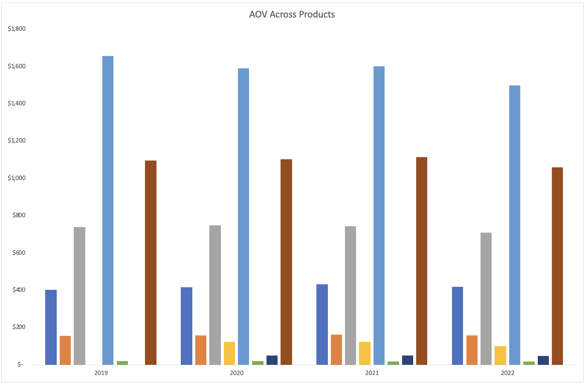

# Table of Contents
- [Company Background](#Company-Background)
- [Executive Summary](#Executive-Summary)
- [Summary of Insights](#Summary-of-Insights)
- [Recommendations](#Recommendations)   
# Company Background
  Elist is an e-commerce company founded in 2018, that sells popular electronics products such as Apple, Samsung, and ThinkPad. Through their online website and mobile app, Elist has expanded to selling their products globally. 
  Analyzing for the Head of Operations, the goal of this analysis is to evaluate Elist's sales performance, customer behavior and operational efficiency over the last several years (2019-2022). This analysis intends to provide insights that will be delievered across teams including finance, sales, products, and marketing. To improve their day-to-day prcoesses and help the company deliver top-notch products to customers around the world.
  
  The key insights and recommedations will focus on the following:

## Northstar Metrics
* **Revenue Performance**

  Measures overall growth of sales, orders, and average order value (AOV), including monthly and yearly trends.
* **Customer Behavior**

    Evaluates how the customers engage with the platform, including loyalty program, and purchase frequency.
* **Product Health**

    Gauges product success and quality throught sales contribution and refund rates by product and category.
  
* **Operational Efficiency**

    Analyzes fulfillment performance across regions, focusing on delivery time and logistical consistency.

  
The **ERD** for the data can be found [here](https://github.com/nlicari1/Elist_analysis/blob/main/ERD_elist.png)

# Executive Summary
Revenue in 2020 peak at **$10.1M**, with the highest average order value being **$300**, making this Elist's strongest financial year. While 2021 recorded a higher order count of over **35k** orders, the lower AOV suggests a shift from high-value purchases to higher transaction volume rather than stronger customer spending.

Non-Loyalty members generated highest total sales at **$17.1M** compared to **$10.8M** for loyalty members, making them the primary driver for revenue. However, loyalty members outperformed non-loyalty members in 2021 and 2022, suggesting that while customer gain drives short-term sales, the loyalty program supports long-term retention.

The most popular product was the **_27in 4k Gaming Monitor_** achieving **$9.8M** in total sales, while the **_Macbook Air Laptop_** produced the highest average order value of **$1,588**. This indicates that Elist relies on both volume-driven products and high-value products, requiring different pricing, inventory, and marketing strategies across product categories.

Although the **_Macbook Air Laptop_** delivers the highest AOV, it also creates the greatest refund risk with an **18%** refund rate. Generally, laptops have the highest refund rate across multiple years, averaging around **17%** during peak periods. While refund rates in 2021 improved, laptops continue to show the highest refund rates and should be looked into further to better understand the cause.

North America produced the highest total sales of **$14.5M**, with its strongest performance year being 2020. This confirms North America as Elist's primary revenue engine and supports continued strategic investment in the region.

Overall, while Elist maintains strong revenue drivers across products and regions, improving customer retention and product return performance presents the greatest opportunity for long-term profits. The [recommendations](#Recommendations) below give a more in-depth outline for improvement.

# Summary of Insights

## Revenue Performance
  
  ### Revenue Peaked in 2020 While Order Volume Shifted in 2021
  <picture>
    
  </picture>
  
  ### 2020 Was Elist's Strongest Sales Year Across All Monthly Trends
  <picture>
    
  </picture>

## Customer Behavior
  ### Non-Loyalty Customers Drive Revenue While Loyalty Supports Retention
  <picture>
    
  </picture>

## Product Health
  ### Gaming Monitors Lead Sales Volume While Laptops Drive Higher-Value Purchases  
  <picture>
    
  </picture>
  
  ### Macbook Air and ThinkPad Generate the Highest Average Order Value
  <picture>
    
  </picture>
  
  ### Refund by Product
  <picture>
    
  </picture>
  
  ### MacBook Air Maintains the Highest Refund Risk Among Apple Products
  <picture>
    
  </picture>
  
## Operational Efficiency 
  ### North America Remains Elist's Primary Revenue-Driving Market
  <picture>
    
  </picture>

# Recommendations

