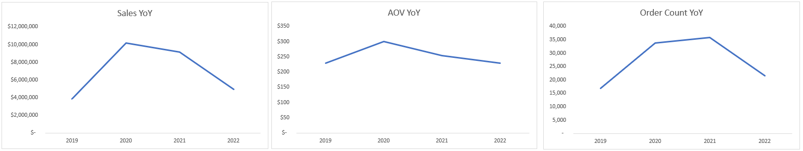
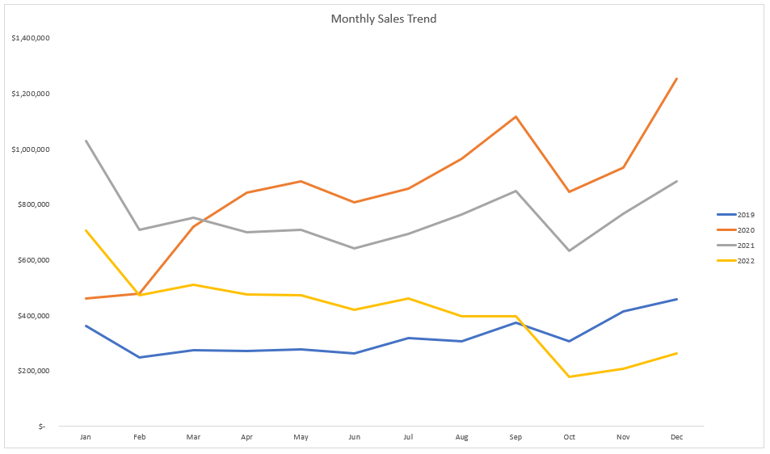
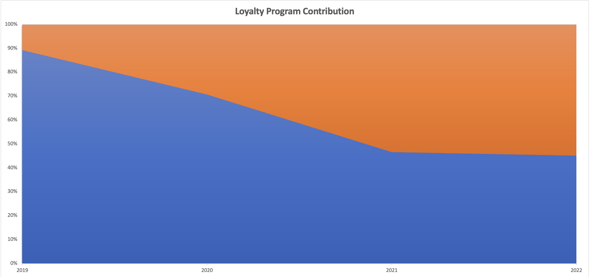
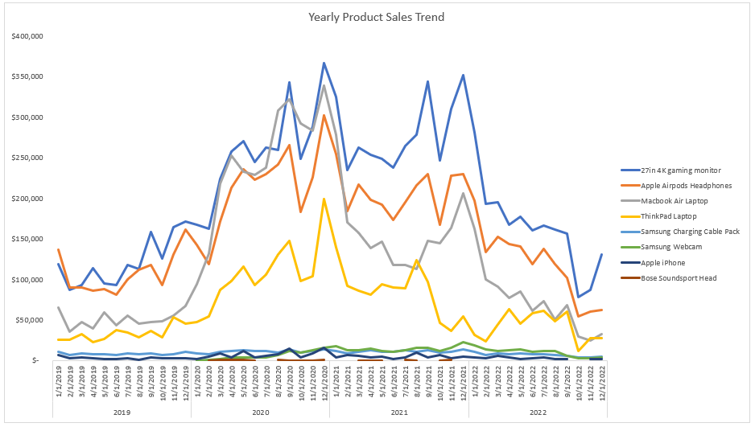
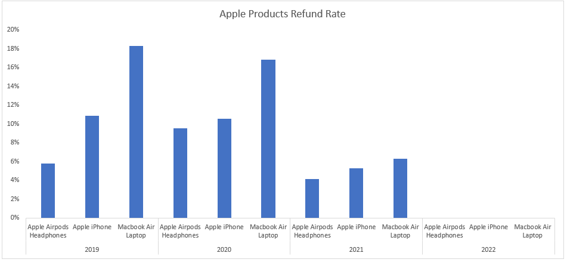
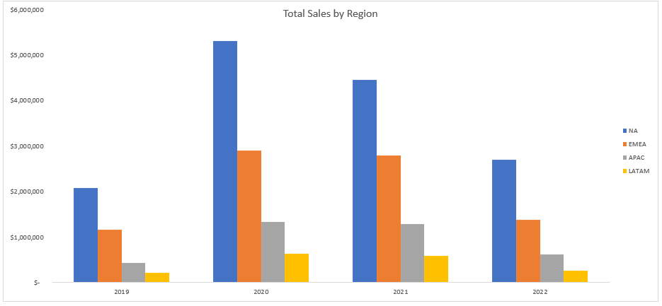

# Table of Contents
- [Company Background](#Company-Background)
- [Executive Summary](#Executive-Summary)
- [Summary of Insights](#Summary-of-Insights)
- [Recommendations](#Recommendations)   
# Company Background
  Elist is an e-commerce company founded in 2018, that sells popular electronics products such as Apple, Samsung, and ThinkPad. Through their online website and mobile app, Elist has expanded to selling their products globally. 
  Analyzing for the Head of Operations, the goal of this analysis is to evaluate Elist's sales performance, customer behavior and operational efficiency over the last several years (2019-2022). This analysis intends to provide insights that will be delievered across teams including finance, sales, products, and marketing. To improve their day-to-day prcoesses and help the company deliver top-notch products to customers around the world.
  
  The key insights and recommedations will focus on the following:

## Northstar Metrics
* **Revenue Performance**

  Measures overall growth of sales, orders, and average order value (AOV), including monthly and yearly trends.
* **Customer Behavior**

    Evaluates how the customers engage with the platform, including loyalty program, and purchase frequency.
* **Product Health**

    Gauges product success and quality throught sales contribution and refund rates by product and category.
  
* **Operational Efficiency**

    Analyzes fulfillment performance across regions, focusing on delivery time and logistical consistency.

  
The **ERD** for the data can be found [here](https://github.com/nlicari1/Elist_analysis/blob/main/ERD_elist.png)

# Executive Summary
Revenue in 2020 peak at **$10.1M**, with the highest average order value being **$300**, making this Elist's strongest financial year. While 2021 recorded a higher order count of over **36k** orders, the lower AOV suggests a shift from high-value purchases to higher transaction volume rather than stronger customer spending.

Non-Loyalty members generated highest total sales at **$17.1M** compared to **$10.8M** for loyalty members, making them the primary driver for revenue. However, loyalty members outperformed non-loyalty members in 2021 and 2022, suggesting that while customer gain drives short-term sales, the loyalty program supports long-term retention.

The most popular product was the **_27in 4k Gaming Monitor_** achieving **$9.8M** in total sales, while the **_Macbook Air Laptop_** produced the highest average order value of **$1,588**. This indicates that Elist relies on both volume-driven products and high-value products, requiring different pricing, inventory, and marketing strategies across product categories.

Although the **_Macbook Air Laptop_** delivers the highest AOV, it also creates the greatest refund risk with an **18%** refund rate. Generally, laptops have the highest refund rate across multiple years, averaging around **17%** during peak periods. While refund rates in 2021 improved, laptops continue to show the highest refund rates and should be looked into further to better understand the cause.

North America produced the highest total sales of **$14.5M**, with its strongest performance year being 2020. This confirms North America as Elist's primary revenue engine and supports continued strategic investment in the region.

Overall, while Elist maintains strong revenue drivers across products and regions, improving customer retention and product return performance presents the greatest opportunity for long-term profits. The [recommendations](#Recommendations) below give a more in-depth outline for improvement.

# Summary of Insights

## Revenue Performance
  
  ### Revenue Peaked in 2020 While Order Volume Shifted in 2021
  <picture>
    
  </picture>

  Reveune significantly increased from 2019-2020, at $3.8M with and AOV of $230 to 10.1M with and AOV of $300. While 2020 was our peak year with sales and average order value, 2021 recorded a higher order count of 36k orders. Displaying a shift from customer spending to transaction volume.
    However, all three metrics decline in 2022, suggesting weaker purchasing activity compared to other years.
  
  
  ### 2020 Was Elist's Strongest Sales Year Across All Monthly Trends
  <picture>
    
  </picture>
  
  2020 was Elist's highest performing financial year, with monthly sales peaking at $1.2M in December. Revenue declined significantly at the start of 2021, dropping to approximately $700k by Feburary before recovering later in the year. Sales patterns also show constitent seasonal strength during the holiday period, with most years peaking towards year-end, except 2022. The decline across sales performance in 2022 suggest weaker customer demand and highlights the need to better understand changes in purchasing behavior and retention.

## Customer Behavior
  ### Non-Loyalty Customers Drive Revenue While Loyalty Supports Retention
  <picture>
    
  </picture>

  In 2019 and 2020, loyalty members underperformed compared to non-loyalty members generating lower total sales and fewer purchases. However, in 2021 and 2022, the loyalty members began outperforming non-loyalty customers, suggesting the loyalty program supports stronger long-term retention.
  

## Product Health
  ### Gaming Monitors Lead Sales Volume While Laptops Drive Higher-Value Purchases  
  <picture>
    
  </picture>
  
  #### Macbook Air and ThinkPad Generate the Highest Average Order Value
  <picture>
    
  </picture>
  
  The 27in 4k Gaming Monitor achieved the highest total sales, peaking at $366k in 2020 and producing a total of $9.8M across all years. In contrast, the MacBook Air Laptop and ThinkPad Laptop produced a highest overall AOV across all years of $1,588 and $1,100, respectively. This indicates that Elist relies on both volume-driven products and high-value products, requiring different pricing, inventory, and marketing strategies across product categories.
  
  
  ### MacBook Air Maintains the Highest Refund Risk Among Apple Products
  <picture>
    
  </picture>

  ### Refund by Product
  <picture>
    
  </picture>
  
  Although the MacBook Air Laptop delivers the highest AOV, it also carries the highest refund rate among Apple products at 18%. Across all products, laptops consistently generate the highest refund rates, with the ThinkPad Laptop having 17% between 2019 and 2020. While refund performance improved across all products in 2021, laptops continued to have the highest refund concern. In addition, 2022 refund rates showed 0% across all products. This suggests a problem with the data that require further investigation.
  
  
## Operational Efficiency 
  ### North America Remains Elist's Primary Revenue-Driving Market
  <picture>
    
  </picture>

  North America shows to be Elist's strongest market, generating $14.5M in total sales and peaking at $5.3M in 2020. In comparison, EMEA produced $8.2M, making North America the company's primary revenue-driving region. This confirms that continued investment into North America should remain a strategis priority while identifying opportunties for expansion in other regions.

# Recommendations
  * The company should review the drivers behind 2020's peak performance and compare them against the 2022 decline to identify opportunities for revenue recovery and stronger year-round customer retention.
## Revenue Performance
  * Elist should strength loyalty conversion strategies by encouraging first-time customers to join the program through incentives, earlier in their purhcasing history.
## Customer Behavior
  * Elist should continue supporting high-volume products like gaming monitors while optimizing premium product strategies for laptops through targeted marketing and pricing decisions.
## Product Health
  * Leadership should prioritize reviewing laptop return behavior and validating 2022 refund reportings to identify potential issues.
## Operational Efficiency 
  * Elist should maintain strong investment in North America while testing targeted growth strategies in other regions to reduce long-term single market dependancy.
